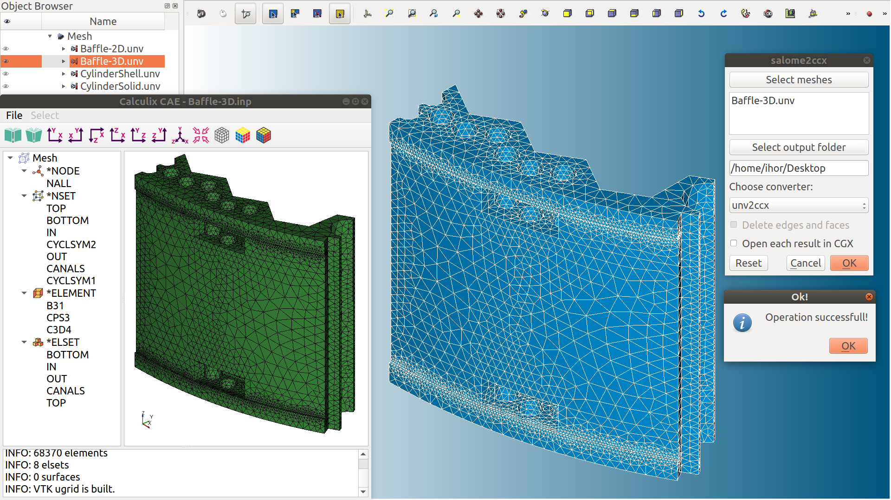

© Lucio Gomez, April 2016  
© Ihor Mirzov, August 2019  
Distributed under GNU General Public License v3.0

  

# Salome to CalculiX mesh exporter

Outputs a Salome mesh to CalculiX .inp file. Generates temporary UNV file and converts it to INP format. For now two converters are available:

- unical3, Bernhardi, August 2011
- unv2ccx, Ihor Mirzov, August 2019

Now script supports multiple mesh processing.

  

# Usage

You'll need only two files:

- [salome2ccx.py](./salome2ccx.py) - main script
- [salome2ccx.ui](./salome2ccx.ui) - GUI form for the main script

See folder [tests](./tests) for list of successfully converted models.

- In Salome select the mesh you wish to export.
- Run script *salome2ccx.py* from the Mesh module (Ctrl+T or File->Load Script...)

  

# Screenshot

INP mesh successfully exported from Salome to [CalculiX CAE](https://github.com/imirzov/ccx_cae):

  

# Videos

Old version Youtube video:

  

# Your help

Please, you may:

- Simply use this software and ask questions.
- Share your models and screenshots.
- Report problems by [posting issues](./issues).
- Do something from the [TODO-list](#TODO).

  

# TODO

- Add logging output to the Salome python console.

- Debug 'Delete edges and faces' feature.

  

# For developers

To compile unical converter use command (Linux):

    gcc unical3.c -o unical3

In Windows you'll need *gcc* from [Cygwin](https://www.cygwin.com/). File *cygwin1.dll* is used by *unical3.exe*.

Here could be found sources and binaries for the [unv2ccx converter](https://github.com/imirzov/unv2ccx/releases).
